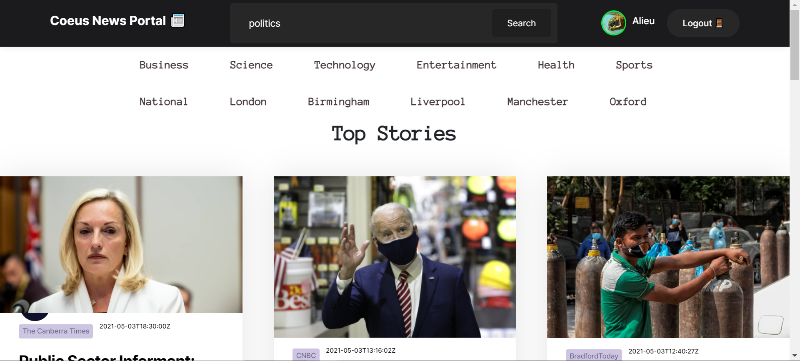

# Coeus News Portal Reactfrontend

## The Task :briefcase:
Find a way to promote / publish local news stories in the national online press so that your local community is represented in the news agenda and people in your area can stay informed in local events.

__The Solution__

- This project was bootstrapped with [Create React App](https://github.com/facebook/create-react-app).
- React App enables us to create interactive UIs. Design simple views for each state in your application.
- The app provides multiple pages to view content based on categories like business, sports , tech etc.
- It also provides content based on location which is crucial for publishing local news at national level.
- We use API Gateway for API GET methods which in turn executes the AWS lambda functions for providing the JSON objects at the endpoints
- These endpoints source data from the AWS MySQL RDS instance which source its data from external API’s.
- The app achieves its objectives is through extracting top news based on each location, assigning a higher rank to such articles and allowing these to be accessed prior to other news articles.
- The higher ranked articles are then rendered in the national new section

## How to Install :computer:

- To begin, clone the GitHub repository
- Navigate into the Project file and run `npm install`
- Then run `npm start`

Runs the app in the development mode.\
Open [http://localhost:3000](http://localhost:3000) to view it in the browser.

## If successful you will see this page.

__Once logged in__

### `npm test`

Launches the test runner in the interactive watch mode.\
See the section about [running tests](https://facebook.github.io/create-react-app/docs/running-tests) for more information.

## Further Development :construction:

-  Reporters - will be allowed to submit their stories (including words, images and video) using Create Articles page, along with relevant tags to provide a mechanism for ranking articles.
- A reveiw section - Content moderators/approvers can verify article information and fact check it.
- POST APIs to post the articles to database.
- Dashboard page -All pending and approved articles will be rendered here.
- CI/CD with Jenkins

<!-- ### `npm run build`

Builds the app for production to the `build` folder.\
It correctly bundles React in production mode and optimizes the build for the best performance.

The build is minified and the filenames include the hashes.\
Your app is ready to be deployed!

See the section about [deployment](https://facebook.github.io/create-react-app/docs/deployment) for more information.

### `npm run eject`

**Note: this is a one-way operation. Once you `eject`, you can’t go back!**

If you aren’t satisfied with the build tool and configuration choices, you can `eject` at any time. This command will remove the single build dependency from your project.

Instead, it will copy all the configuration files and the transitive dependencies (webpack, Babel, ESLint, etc) right into your project so you have full control over them. All of the commands except `eject` will still work, but they will point to the copied scripts so you can tweak them. At this point you’re on your own.

You don’t have to ever use `eject`. The curated feature set is suitable for small and middle deployments, and you shouldn’t feel obligated to use this feature. However we understand that this tool wouldn’t be useful if you couldn’t customize it when you are ready for it.

## Learn More

You can learn more in the [Create React App documentation](https://facebook.github.io/create-react-app/docs/getting-started).

To learn React, check out the [React documentation](https://reactjs.org/).

### Code Splitting

This section has moved here: [https://facebook.github.io/create-react-app/docs/code-splitting](https://facebook.github.io/create-react-app/docs/code-splitting)

### Analyzing the Bundle Size

This section has moved here: [https://facebook.github.io/create-react-app/docs/analyzing-the-bundle-size](https://facebook.github.io/create-react-app/docs/analyzing-the-bundle-size)

### Making a Progressive Web App

This section has moved here: [https://facebook.github.io/create-react-app/docs/making-a-progressive-web-app](https://facebook.github.io/create-react-app/docs/making-a-progressive-web-app)

### Advanced Configuration

This section has moved here: [https://facebook.github.io/create-react-app/docs/advanced-configuration](https://facebook.github.io/create-react-app/docs/advanced-configuration)

### Deployment

This section has moved here: [https://facebook.github.io/create-react-app/docs/deployment](https://facebook.github.io/create-react-app/docs/deployment)

### `npm run build` fails to minify

This section has moved here: [https://facebook.github.io/create-react-app/docs/troubleshooting#npm-run-build-fails-to-minify](https://facebook.github.io/create-react-app/docs/troubleshooting#npm-run-build-fails-to-minify) -->
